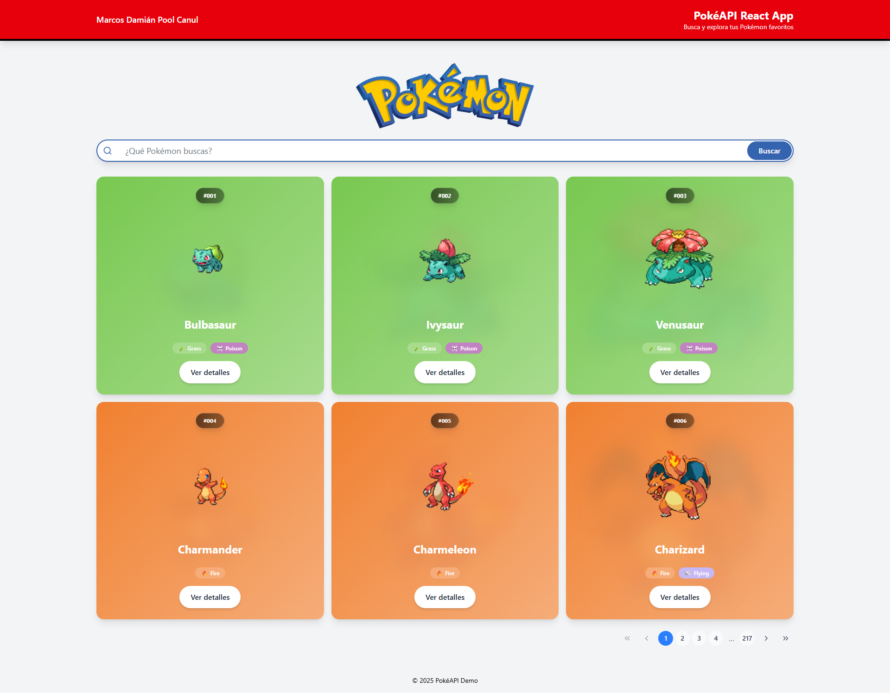
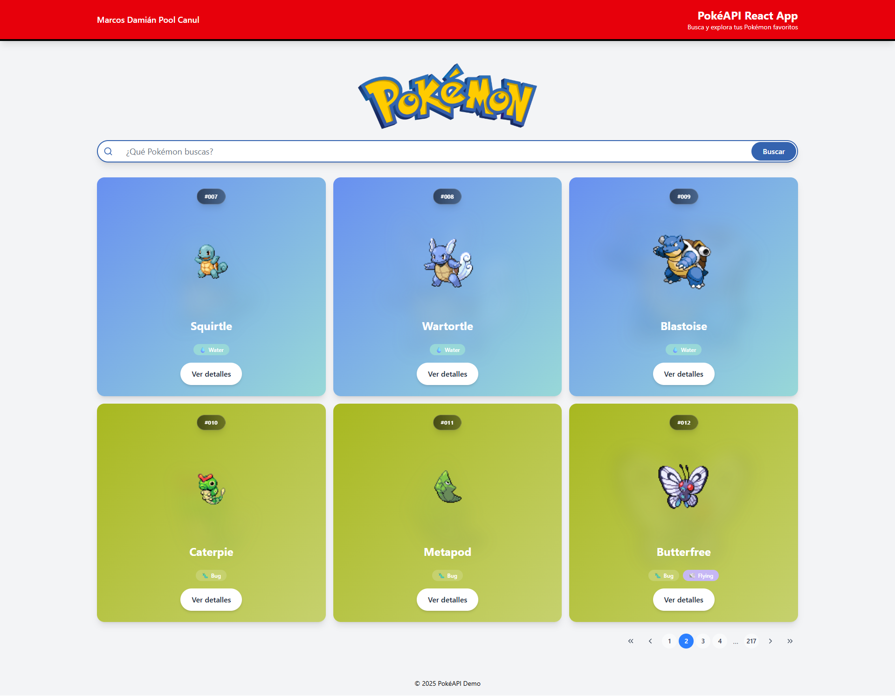
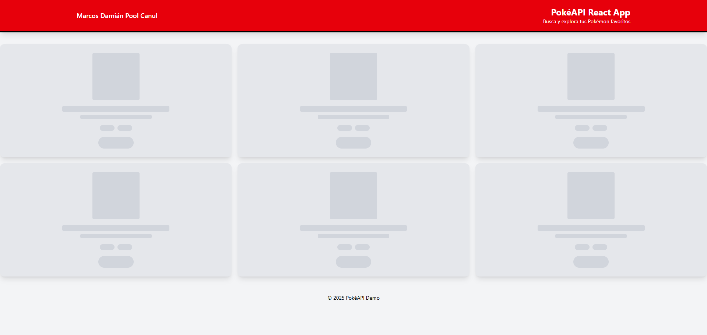
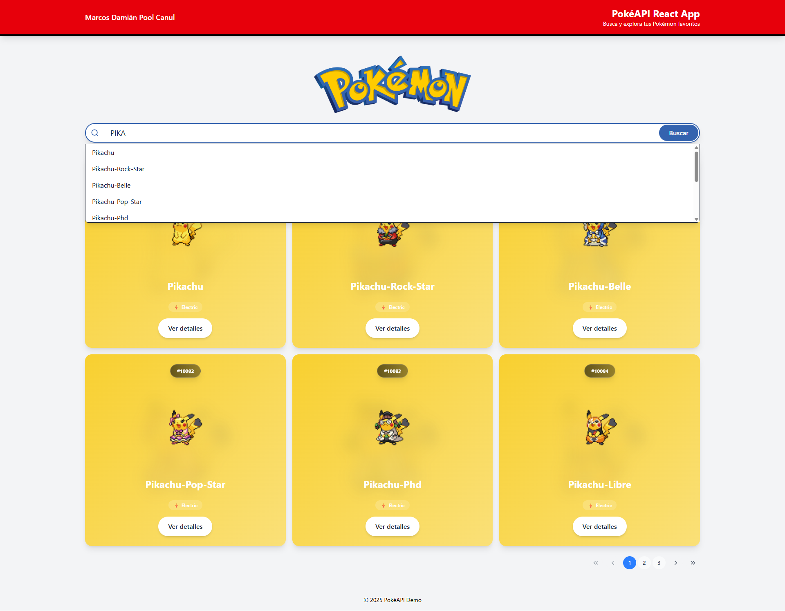
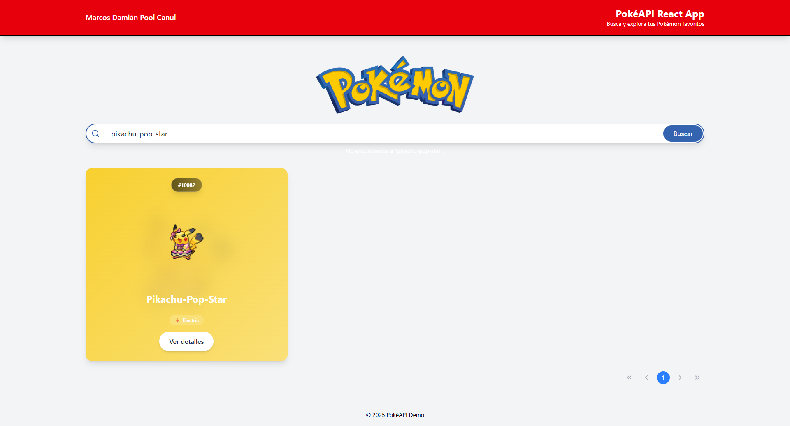
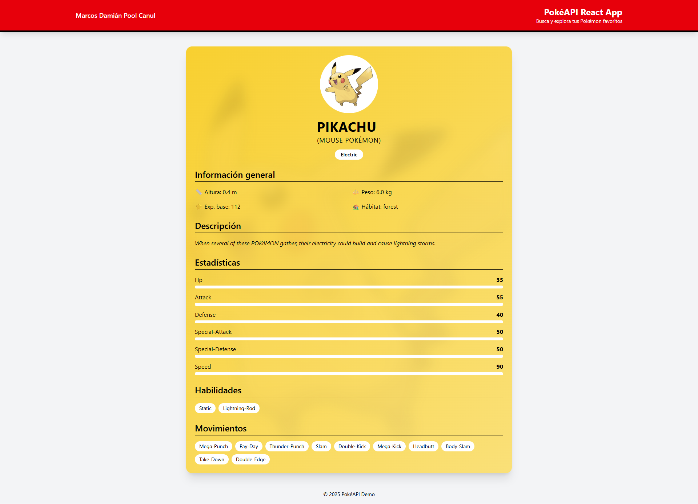
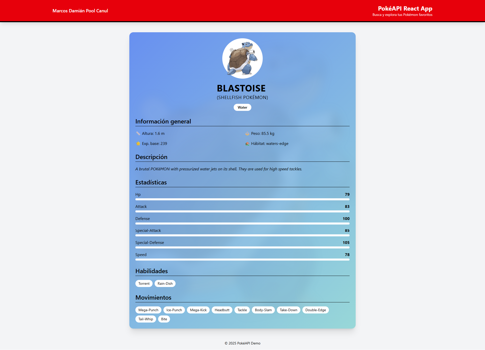
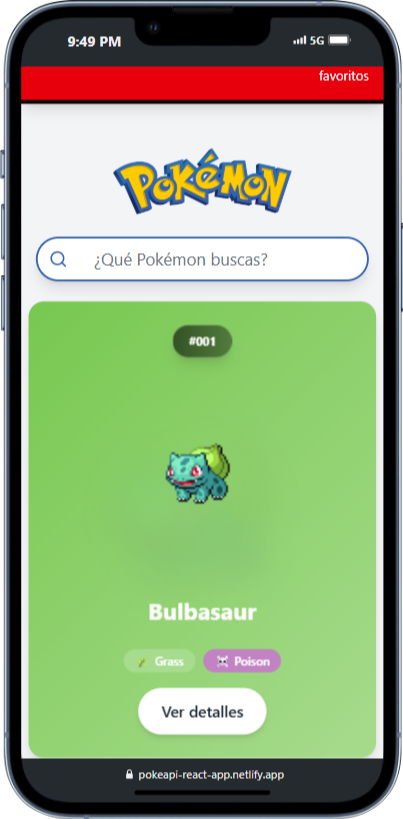
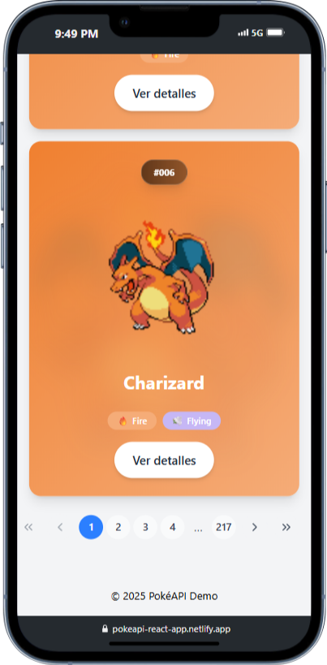
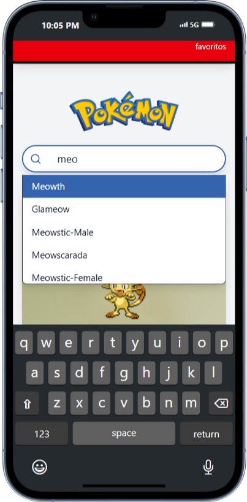

# [PokeExplorer](https://pokeapi-react-app.netlify.app/)

Una aplicación web moderna y responsive para explorar el fascinante mundo de Pokémon. Construida con React, TypeScript y diseñada con una interfaz elegante que se adapta dinámicamente a los colores y tipos de cada Pokémon.

**¡Prueba la aplicación ahora mismo!** 👉 [https://pokeapi-react-app.netlify.app/](https://pokeapi-react-app.netlify.app/)

_No necesitas instalar nada localmente. Simplemente haz clic en el enlace y comienza a explorar el mundo Pokémon._

---

## Descripción

PokeExplorer es una aplicación interactiva que permite a los usuarios buscar, explorar y conocer en detalle información sobre más de 1000 Pokémon. La aplicación consume la PokéAPI para obtener datos actualizados y presenta la información de manera visualmente atractiva con gradientes dinámicos basados en los tipos de Pokémon.

## Capturas principales

### Página principal




---

### Cargando



---

### Buscador inteligente




---

### Tarjetas de Pokémon




---

### Diseño adaptativo






---

## Características visuales

- Vista principal con grid de tarjetas de Pokémon con gradientes dinámicos
- Buscador inteligente con sugerencias en tiempo real
- Tarjetas con colores adaptativos según el tipo de Pokémon
- Diseño responsive optimizado para móviles y escritorio
- Loader elegante durante la carga de datos

## Funcionalidades

- **Búsqueda inteligente**: Sistema de búsqueda con autocompletado y sugerencias
- **Exploración por páginas**: Navegación paginada para explorar todos los Pokémon
- **Detalles completos**: Información detallada incluyendo estadísticas, habilidades y movimientos
- **Diseño adaptativo**: Colores y gradientes que cambian según el tipo de Pokémon
- **Interfaz responsive**: Optimizada para dispositivos móviles y escritorio
- **Navegación fluida**: Transiciones suaves entre páginas

## Tecnologías utilizadas

- **React 18** - Biblioteca de interfaz de usuario [https://reactjs.org/](https://reactjs.org/)
- **TypeScript** - Tipado estático para JavaScript [https://www.typescriptlang.org/](https://www.typescriptlang.org/)
- **Vite** - Herramienta de construcción rápida [https://vitejs.dev/](https://vitejs.dev/)
- **React Router DOM** - Enrutamiento del lado del cliente [https://reactrouter.com/](https://reactrouter.com/)
- **Redux Toolkit** - Gestión de estado global [https://redux-toolkit.js.org/](https://redux-toolkit.js.org/)
- **Tailwind CSS** - Framework de CSS utilitario [https://tailwindcss.com/](https://tailwindcss.com/)
- **React Icons** - Biblioteca de iconos [https://react-icons.github.io/react-icons/](https://react-icons.github.io/react-icons/)

## Herramientas utilizadas

- **PokéAPI** - API REST para datos de Pokémon [https://pokeapi.co/](https://pokeapi.co/)
- **ESLint** - Linter para código JavaScript/TypeScript
- **VS Code** - Editor de código
- **Git** - Control de versiones
- **npm** - Gestor de paquetes

---

## Instrucciones para iniciar el proyecto

### Prerrequisitos

- Node.js (versión 22 o superior)
- npm o yarn

### Instalación

1. **Clona el repositorio**

   ```bash
   git clone https://github.com/marcosd59/pokeapi-react-app.git
   cd pokeapi-react-app
   ```

2. **Instala las dependencias**

   ```bash
   npm install
   ```

3. **Inicia el servidor de desarrollo**

   ```bash
   npm run dev
   ```

4. **Abre tu navegador**

   ```
   http://localhost:5173
   ```

### Estructura del proyecto

```
pokeapi-react-app/
├── public/           # Archivos estáticos
├── src/
│   ├── components/   # Componentes reutilizables
│   ├── pages/        # Páginas de la aplicación
│   ├── features/     # Estado de Redux
│   ├── types/        # Tipos de TypeScript
│   ├── api/          # Funciones de API
│   └── assets/       # Imágenes y recursos
├── docs/             # Documentación
└── README.md         # Documentación principal
```

### Solución de problemas comunes

1. **Error de puerto ocupado**

   - Vite buscará automáticamente un puerto disponible
   - O puedes especificar uno diferente: `npm run dev -- --port 3000`

2. **Errores de dependencias**

   - Elimina node_modules: `rm -rf node_modules`
   - Reinstala: `npm install`

3. **Problemas de cache**
   - Limpia la cache de Vite: `npm run dev -- --force`

---

## Uso

1. **Página principal**: Explora la lista de Pokémon con paginación
2. **Búsqueda**: Usa la barra de búsqueda para encontrar Pokémon específicos
3. **Detalles**: Haz clic en "Ver detalles" para obtener información completa
4. **Navegación**: Usa el logo para volver a la página principal

## Autor

**Marcos Pool Canul**

---

_Desarrollado con ❤️ usando React y la PokéAPI_
